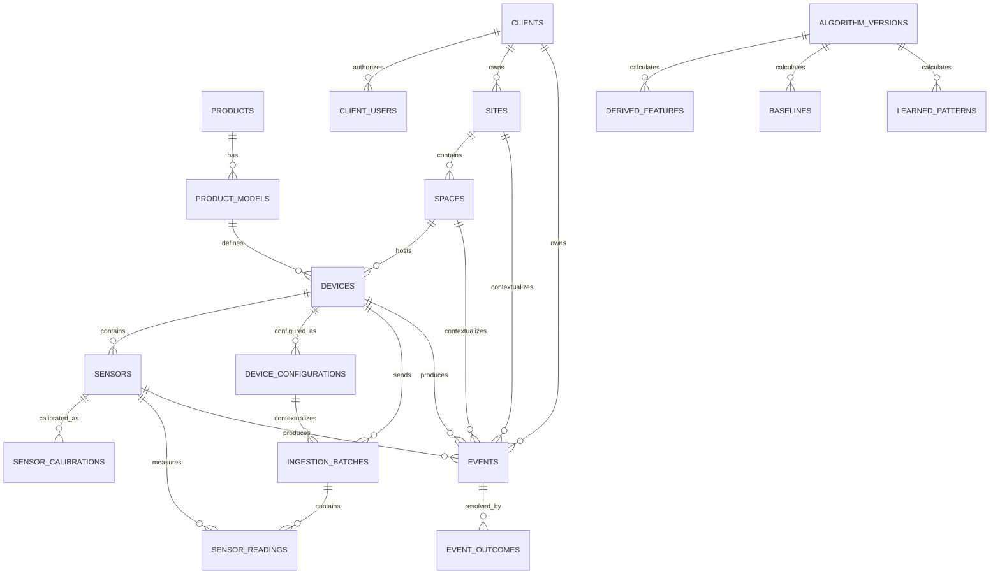

# STS data architecture

## 1. Purpose and principles

This design prepares STS for multiple products, models, clients, installations,
sensors and future learning without replacing the operational STS Cold path.

The governing rules are:

1. Raw device payloads are append-only and remain available for reprocessing.
2. Organizational and technical context is modeled explicitly with foreign keys.
3. The device sends its public code and sensor values; the backend resolves context.
4. Client data is private. Global knowledge contains only aggregated, anonymized or
   explicitly transferable artifacts, never another client's raw readings.
5. Features, baselines and patterns identify the algorithm version and training window.
6. Existing firmware, `/api/temperature`, `devices`, `readings`, `alerts` and
   `device_access` remain operational during migration.

## 2. Current-state assessment

The repository does not contain the original schema migration. The current schema
below is therefore reconstructed from the incremental migrations and application
queries. It must be verified against a production schema dump before deployment.
The preflight script also stops if an existing non-UUID `devices.id` would conflict
with the new stable internal identifier.

### Existing data model

- `devices`: keyed operationally by the human-readable `device_id`; stores name,
  location, latest temperature/humidity, status, `last_seen`, configuration JSON,
  configuration version, firmware version and pairing fields.
- `readings`: one wide row per STS Cold sample with `device_id`, primary monitored-environment temperature
  and humidity, optional legacy sensor values, timestamps, alarm/offline metadata and
  communication diagnostics.
- `alerts`: operational alert history keyed by `device_id`.
- `profiles`: platform users, roles, active state and presentation/organization labels.
- `device_access`: user-to-device grants (`can_view`, `can_edit`) and the current
  tenant boundary used by the dashboard.
- Additional notification/configuration data is stored partly in `devices.config`
  and related tables accessed by the backend.

For `sensor_semantics_version=2`, the SHT30 is the primary monitored-environment
sensor carried in `temperature`/`humidity`; the DHT22 is internal diagnostics in
`internal_temperature`/`internal_humidity` and normalized as `interior_*`. Payloads
without the marker retain the legacy DHT22-main/SHT30-exterior interpretation.
The first v2 ingestion records `sensor_semantics_v2_since`; if normalized history
is unavailable, older ambiguous main values are hidden rather than relabelled.

### Existing flow

```text
ESP32
  -> POST /api/temperature (global Authorization token)
  -> Node/Express on Render (Supabase service_role)
  -> readings + current devices state + alerts
  -> Supabase realtime / Next.js server routes
  -> dashboard filtered by profile role and device_access
```

The new heartbeat endpoint updates device presence and diagnostics without creating
fake readings.

### Existing API and authorization

- Device ingestion: `POST /api/temperature` and `POST /api/device/heartbeat`.
- Device configuration: `GET /api/device/:id/config`.
- Dashboard server routes: overview, history, alerts, configuration and reports.
- Firmware currently authenticates with one shared API token. `device_id` identifies
  the sender but is not itself a credential.
- The backend uses `SUPABASE_SERVICE_ROLE_KEY`, so backend operations bypass RLS.
- Dashboard access checks use `profiles.role` and `device_access` before data queries.

### Current limitations

- Product, model, client, site, space and sensor are not first-class relations.
- `location` and profile labels carry organizational meaning without referential integrity.
- A wide STS Cold reading cannot naturally represent future Engine/Grow/Air sensors.
- No immutable raw envelope exists for exact reprocessing.
- Alerts do not capture a complete diagnosis/action/outcome lifecycle.
- Only current configuration is directly available; historical technical context is absent.
- The shared device token cannot be rotated or revoked per device.
- Existing access is device-grant based, not organization-membership based.

## 3. Gap analysis

| Requirement | Assessment | Action |
|---|---|---|
| Devices, readings, alerts | Already exists | Preserve as compatibility path |
| Firmware version and communication diagnostics | Already exists | Link future readings to configuration sessions |
| Product/model hierarchy | New tables | `products`, `product_models` |
| Client/site/space hierarchy | New tables | `clients`, `client_users`, `sites`, `spaces` |
| Stable internal UUID for device | Small adaptation | Add `devices.id`; retain public `device_id` |
| Multiple sensors per device | New table | `sensors` registry |
| Generic time series | New tables | `ingestion_batches`, `sensor_readings` |
| Immutable raw payload | New table | Append-only `ingestion_batches.raw_payload` |
| Historical configuration/calibration | New tables | `device_configurations`, `sensor_calibrations` |
| Operational events | New table | Extensible `events` |
| Ground truth | New table | `event_outcomes` linked to events |
| Derived features | New table, calculations can wait | `derived_features` |
| Individual baselines | New table, learning can wait | `baselines` |
| Learned knowledge scopes | New table, learning can wait | `learned_patterns` |
| Algorithm traceability | New table | `algorithm_versions` |
| Per-device credentials | Schema now, rollout later | `device_credentials` |
| Partitioning/retention automation | Can wait | Reassess at measured volume thresholds |
| Predictive ML | Can wait | Data foundation only |

## 4. Proposed relational model



### Identifier strategy

- Internal relational keys are UUIDs.
- `devices.id` is stable and internal.
- `devices.device_id` remains the public code, for example `STS-COLD-014`, and
  remains compatible with firmware and existing URLs.
- Client names, site names and room names are never identifiers.

### Context lookup

A normalized measurement inherits context through:

```text
sensor_reading -> sensor -> device -> space -> site -> client
                              |
                              -> product_model -> product
```

`sensor_readings_context` exposes this join as a `security_invoker` view. IDs are
not repeated in each measurement. The controlled exception is `events.client_id`:
events copy the tenant key because they can exist at client/site/space/device/sensor
scope, and a direct tenant key makes RLS and high-volume event queries safer and faster.

## 5. Ingestion and immutability

The compatibility ingestion path is:

1. Validate the existing payload and shared token.
2. Write/update the existing `readings` and `devices` records exactly as before.
3. Resolve `devices.id` from the public `device_id`.
4. Resolve or create the active `device_configuration` snapshot.
5. Append one `ingestion_batch` containing the exact JSON payload and SHA-256 digest.
6. Resolve the device's sensor registry.
7. Append one `sensor_reading` per valid sensor value.

The dual write is deliberately best-effort during rollout. If the normalized tables
are not deployed, legacy ingestion succeeds and the response reports
`normalized_schema_not_deployed`. After production verification this should become a
monitored invariant and normalized-write failures should alert operators.

`telemetry_seq` provides idempotency per device. Raw payloads and normalized readings
are not updated by application code. Authenticated dashboard roles have no update or
delete privilege on these tables.

The legacy `readings` table remains the source for the current dashboard until a later,
separately tested read cutover. No historical rows are deleted or rewritten.

## 6. Configuration and calibration history

`device_configurations` uses effective time ranges. A new row is opened when firmware,
hardware or configuration version changes, and each ingestion batch references the
active row. This answers which technical configuration produced a reading without
repeating firmware/configuration on every sensor value.

`sensor_calibrations` applies the same effective-range model to sensor calibration.
A future ingestion resolver can attach the effective calibration to derived processing;
the raw measured value always remains unchanged.

## 7. Events and ground truth

`events` is one extensible table for automatic, system, technician, client and future AI
events. `event_type` is a stable machine code such as `door_opened`,
`temperature_alarm`, `maintenance_performed` or `confirmed_failure`. Product-specific
details belong in metadata only after structural references have been modeled.

`event_outcomes` is separate because diagnosis, action and observed result have a
different lifecycle from detection. `is_ground_truth=true` marks reviewed real-world
outcomes suitable for supervised evaluation or future training.

Example query concept for the 72 hours before confirmed compressor failures:

```sql
select gt.event_id, r.*
from ground_truth_context gt
join sensors s on s.device_id = gt.device_id
join sensor_readings_context r on r.sensor_id = s.id
where gt.diagnosis_code = 'compressor_failure'
  and gt.is_ground_truth
  and r.recorded_at >= gt.start_time - interval '72 hours'
  and r.recorded_at < gt.start_time;
```

Existing alert writes are mirrored into `events` when a device has complete
space/site/client context. The old `alerts` table is retained for dashboard compatibility.

## 8. Learning scopes and traceability

`algorithm_versions` is the registry for every feature, baseline or learned pattern.

- `derived_features`: calculated values over explicit source windows.
- `baselines`: private learned distributions for a space, device or sensor.
- `learned_patterns`: GLOBAL, PRODUCT, MODEL, CLIENT, SPACE or DEVICE knowledge.

Global patterns must have no client reference and must be marked `aggregated`,
`anonymized` or `transferable`. Client/private baselines and patterns remain behind
tenant RLS. Model parameters are outputs; raw private readings are never copied between
clients.

## 9. Multi-tenant policy

- `client_users` is the normalized organization membership boundary.
- Users can read only rows whose client is accessible through active membership.
- Existing `device_access` remains accepted by `sts_can_access_device_uuid` during
  migration, preventing dashboard regressions.
- STS `admin`/`super_admin` profiles can administer the hierarchy.
- The service-role backend can ingest across tenants and must never expose its key.
- Credential hashes are not granted to authenticated dashboard users.
- `security_invoker` context views preserve underlying RLS.

Before switching the dashboard from `device_access` to client membership, every current
device must be assigned to a space and every current user grant must be mapped to the
appropriate client membership. Do not remove legacy grants in the same release.

## 10. Performance and future scale

Current indexes support:

- sensor + time range;
- device ingestion time;
- device/space/site/client joins;
- event type + device + time;
- confirmed ground-truth events;
- feature/baseline/pattern scope lookups.

Recommended measured thresholds, not immediate requirements:

- Consider monthly range partitioning of `sensor_readings` and `ingestion_batches`
  when table/index maintenance or query plans show material degradation (typically
  hundreds of millions of rows, not merely because time-series data exists).
- Add scheduled rollups only after real query patterns identify required windows.
- Keep raw retention policy explicit and customer/legal aware. Archive to object storage
  before any future deletion policy.
- Use `EXPLAIN (ANALYZE, BUFFERS)` with production-like ranges before adding duplicated
  tenant IDs to measurement rows.

## 11. Device security roadmap

Current risk: one leaked shared API token permits impersonation of any known device ID.

`device_credentials` prepares individual hashed credentials with activation, expiry,
rotation and revocation. The safe rollout is:

1. Generate a random secret during controlled provisioning; store only its hash.
2. Return/show the plaintext secret once to the provisioning operator/device.
3. Accept both shared and per-device credentials during a measured transition.
4. Record `last_used_at`, monitor failures, then disable the shared token per device.
5. Rotate by creating a new credential linked through `rotated_from_id` and revoke the old.

This release creates the schema only; firmware authentication remains compatible.

## 12. Migration sequence

Apply in order, in staging first:

0. Run `supabase/tests/preflight_schema_check.sql` and review the existing RLS output.
1. `20260819_01_core_hierarchy.sql`
2. `20260819_02_normalized_ingestion.sql`
3. `20260819_03_events_ground_truth.sql`
4. `20260819_04_learning_foundations.sql`
5. `20260819_05_rls_and_device_security.sql`
6. `20260819_06_secure_device_pairing.sql`

Then:

1. Run `supabase/tests/data_architecture_test.sql` in a disposable/staging database.
2. Deploy the backend dual-write code.
3. Confirm legacy and normalized row counts for several devices.
4. Assign existing devices to client/site/space in controlled batches.
5. Map existing `device_access` grants to `client_users`; retain both.
6. Monitor normalized-write failures and duplicate telemetry sequences.
7. Only after parity, add dashboard screens that read the normalized context views.
8. Plan a separate historical backfill job. Do not run an unbounded backfill in a migration.

Rollback is release-based: the current application does not depend on the new tables,
so backend dual write can be disabled without dropping schema or data. Never drop the
new raw tables as a rollback mechanism.

## 13. Validation

`supabase/tests/data_architecture_test.sql` runs in a transaction and rolls back. It
creates product, model, two clients, sites, spaces, devices, sensors and readings;
queries by sensor/space/client/time; creates alarm, maintenance and confirmed-failure
events; verifies ground truth; and impersonates Client A and Client B to assert that
neither can read the other's normalized data.

Application checks:

- `node --check server.js`
- dashboard lint and production build
- existing ESP32 payload against `/api/temperature`
- response contains `normalized_ingestion.stored=true` after migrations
- current dashboard overview/history/alerts remain unchanged

## 14. Deliberately deferred work

- ML training, prediction and automated baseline computation.
- Dashboard administration UI for the full hierarchy.
- Historical backfill of legacy wide readings.
- PostgreSQL partitioning and automated archival.
- Mandatory per-device credentials.
- Retirement of `readings`, `alerts`, `device_access` or public `device_id` relations.

These are deferred to avoid a big-bang migration while keeping the target architecture
open and traceable.
